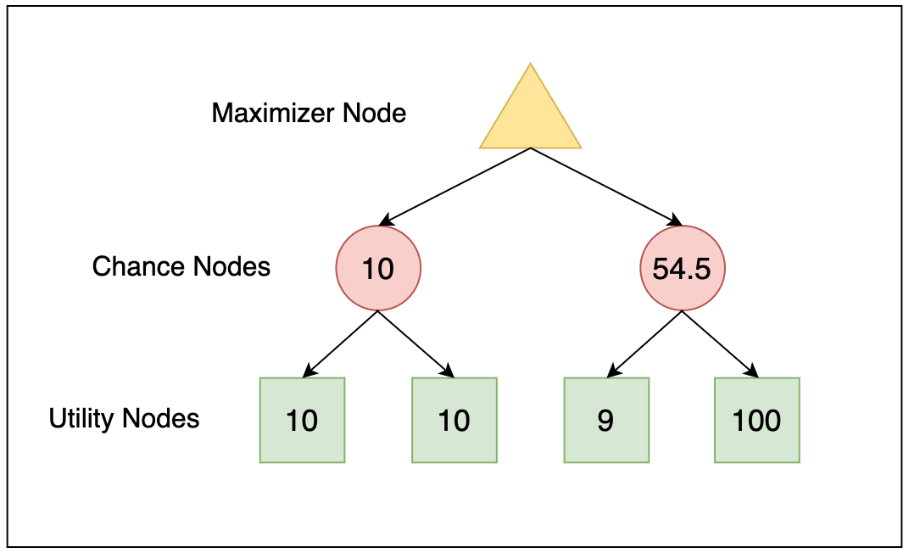

# 2048_Solver
## Description of Game/Rules
2048 is sliding block puzzle game developed by Gabriele Cirulli. It’s a game played on a 4x4 grid with tiles numbered 2^n where ‘n’ represents a natural number. The objective of the game is to combine tiles of the same number to eventually form the number 2048. The user can move in the four cardinal directions and after every move a new tile is generated randomly in the grid which is either numbered 2 or 4 with a probability of about .10. A move is legal if at least one tile can be slid into an empty spot or if the tiles can be combined in the chosen direction. The game ends when the user does not have any legal moves left.

The goal is to achieve the tile 2048.

## Algorithm used to solve 2048
To account for the randomness of the added value of 2 or 4 for each move of the board, Expectimax was the chose algorithm for this problem. Expectimax is a decision-making algorithm mostly used in scenarios where uncertainty or chance is involved. It constructs a game tree that represents all the possible moves and chance outcomes, then evaluates the tree nodes to determine the best possible move for a specific game state.

The image above shows a small example of the game tree, where chance nodes calculate the average of their children, the utility nodes, which the expected utility as the value upon them. The maximizer is at the root node, so it moves toward the maximum expected utility node and afterward toward the maximum available utility node.

## Results
The current implementation runs at a success rate of 40%. To make this algorithm more efficient, I plan to keep the heuristic scoring the same, but enhancing the averaging technique. Instead of getting the average at each recursive step, I will only focus on the average of the last recursion to influence the game's next decision.
